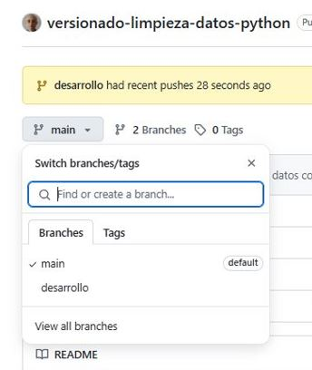

# 🧼 Versionado y Limpieza de Datos con Python

Este proyecto aplica buenas prácticas de análisis de datos y control de versiones usando Python y Git, simulado de forma individual como en entornos reales de trabajo.

---

## 📌 Objetivo

- Limpiar un conjunto de datos de ventas con Python (`pandas`, `openpyxl`).
- Aplicar control de versiones con Git paso a paso.
- Subir y documentar el flujo completo en GitHub como parte del portafolio profesional.

---

## 📁 Estructura del Proyecto

versionado-analisis-datos/
│
├── data/ # Datos de entrada y salida en Excel
│ ├── ventas_dia2.xlsx
│ └── archivo_ventas.xlsx
│
├── python/ # Script de limpieza de datos
│ └── ventas.py
│
├── docs/ # Capturas del flujo Git real
│ └── *.JPG
│
├── paquetes.txt # Requisitos del proyecto
├── .gitignore # Exclusiones recomendadas
├── README.md # Documentación general

---

## 🧭 Flujo de Control de Versiones Real con Git y GitHub

Este proyecto también tiene como objetivo reforzar el uso real de Git y GitHub paso a paso, simulando un entorno de trabajo profesional.  
A continuación, se muestra la evidencia capturada de cada paso aplicado en el flujo de versionado:

| Acción realizada                      | Captura |
|--------------------------------------|---------|
| Inicializar Git y primer commit      |  |
| Crear una rama (`desarrollo`)        | .JPG) |
| Crear el repositorio en GitHub       |  |
| Conectar proyecto local a GitHub     |  |
| Realizar `push` desde rama `desarrollo` |  |
| Confirmar que la rama fue subida     |  |

---
